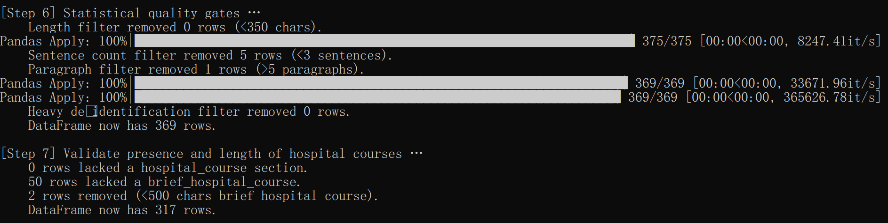

# 🛠️ Data Preprocessing of Training Dataset

This guide describes how to preprocess the training data used in  
**[A Data-Centric Approach To Generate Faithful and High Quality Patient Summaries with Large Language Models](https://arxiv.org/abs/2402.15422)**.

---

## 1️⃣ Get MIMIC-IV-Note v2.2

We use the **MIMIC-IV-Note v2.2** dataset, the same source as in the original paper.

- To fully reproduce the pipeline, download the complete dataset from PhysioNet.
- To **quickly test or demo**, use the pre-sampled file `discharge_short.csv` available in the `data/` folder.
- For full dataset processing, locate `discharge.csv` after unzipping the downloaded archive.

---

## 2️⃣ Set Environment Variable

Set the `PYTHONPATH` to point to the root directory of this repo:

### On Windows:
```bash
set PYTHONPATH=/path/to/this/CS598_Project
```
### On Linux/macOS:
```bash
export PYTHONPATH=/path/to/this/CS598_Project
```

## 3️⃣ Preprocess the Dataset
Use the following command to preprocess the data (adjust input path as needed):
```bash
python preprocess/run_mimic_data_preprocess.py \
    --which_step 1 \
    --input data/discharge_short.csv \
    --output_dir data_processed
```
After running, you should see logs in your terminal like:


## 4️⃣ Split into Train/Val/Test Sets
To divide the processed dataset into training, validation, and test splits, run:

```bash
python preprocess/split_dataset.py \
    --input data_processed/mimic_processed_summaries.csv \
    --output_dir data_processed \
    --hospital_course_column brief_hospital_course \
    --summary_column summary
```